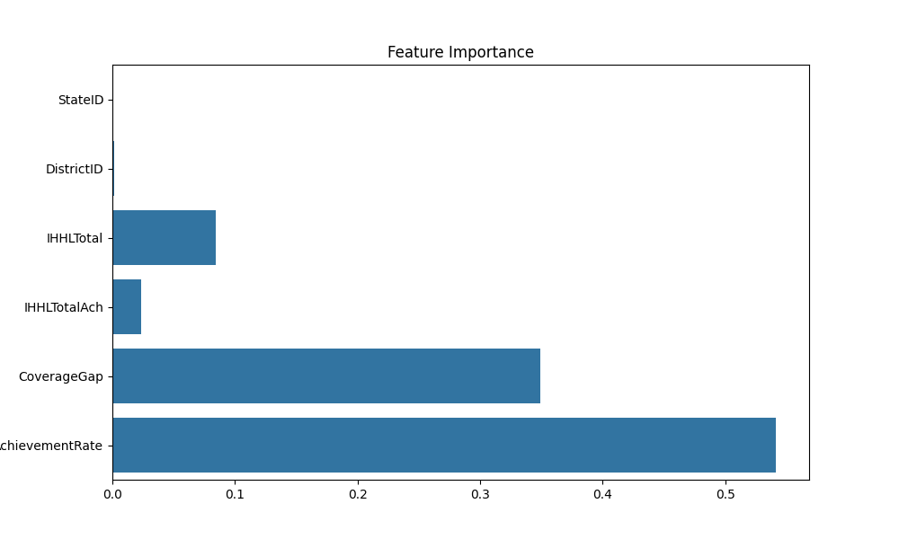

Sanitation Infrastructure Completion Prediction using Hybrid Swarm Intelligence Algorithms
Project Overview

Access to proper sanitation infrastructure is a crucial part of public health and sustainable development. Governments often collect district-level data about sanitation coverage and toilet construction progress. However, identifying whether infrastructure targets will be completed efficiently requires predictive analysis.

This project applies Machine Learning with Hybrid Swarm Intelligence Optimization Algorithms to predict sanitation infrastructure completion levels based on government sanitation datasets.

The system trains machine learning models optimized using bio-inspired algorithms such as AIS, PSO, CSA, BA, and ALOA. These algorithms are combined into hybrid models to improve prediction performance.

The project predicts household toilet coverage completion percentage using historical infrastructure data.

Dataset Description

The dataset contains sanitation infrastructure statistics collected across regions.

Example fields:

Column	Description
StateName	State name
Date	Data reporting date
IHHLTotal	Total number of toilets planned
IHHLTotalAch	Number of toilets completed
IHHLCoveragePer	Toilet coverage percentage

Additional engineered features:

CoverageGap = IHHLTotal − IHHLTotalAch

AchievementRate = IHHLTotalAch / IHHLTotal

These features help improve predictive performance.

Machine Learning Model

The project uses:

Random Forest Regressor

Why Random Forest:

Handles nonlinear relationships

Robust to noise

Works well with tabular government datasets

Supports feature importance analysis

The Random Forest hyperparameters are optimized using swarm intelligence algorithms.

Hybrid Optimization Algorithms Used

The project evaluates multiple hybrid optimization strategies.

Prefix	Hybrid Model
cis_	AIS + CSA
pis_	AIS + PSO
bis_	AIS + BA
psa_	PSO + CSA
bsa_	BA + CSA
sloa_	ALOA + AIS
ploa_	PSO + ALOA
cloa_	CSA + ALOA
bloa_	BA + ALOA

Each hybrid algorithm optimizes:

Random Forest n_estimators

Random Forest max_depth

to improve prediction accuracy.

Optimization Algorithms Explained
Artificial Immune System (AIS)

AIS is inspired by the human immune system. It uses cloning and mutation to search for optimal solutions.

Key characteristics:

Adaptive learning

Clonal selection

Mutation of best solutions

Particle Swarm Optimization (PSO)

PSO is inspired by flocking behavior of birds.

Each particle updates position based on:

personal best solution

global best solution

Crow Search Algorithm (CSA)

CSA models the behavior of crows hiding and stealing food.

Key properties:

memory of hiding places

awareness probability

random following behavior

Bat Algorithm (BA)

BA mimics echolocation behavior of bats.

Important properties:

loudness adjustment

pulse emission rate

frequency tuning

Ant Lion Optimization Algorithm (ALOA)

ALOA simulates hunting mechanism of ant lions trapping ants.

Key mechanisms:

random walks

trap building

exploitation of best solution

Project Workflow

The overall system workflow:

Load sanitation dataset

Preprocess dataset

Perform feature engineering

Split dataset into training and testing sets

Normalize features

Apply hybrid swarm optimization

Train Random Forest model

Evaluate model performance

Save predictions and results

Generate graphs and comparison metrics

Feature Engineering

New predictive features are created:

CoverageGap

CoverageGap = IHHLTotal − IHHLTotalAch

AchievementRate

AchievementRate = IHHLTotalAch / IHHLTotal

These features represent infrastructure progress efficiency.

Evaluation Metrics

Model performance is evaluated using:

R² Score

Measures how well predictions match actual values.

Range:

0 → poor prediction
1 → perfect prediction

RMSE (Root Mean Square Error)

Measures average prediction error magnitude.

Lower RMSE means better prediction accuracy.

Visualizations Generated

The system automatically generates multiple graphs.

Correlation Heatmap

Shows relationships between dataset variables.

File example:

cis_heatmap.png
Accuracy Graph

Shows performance score of the hybrid model.

Example:

cis_accuracy_graph.png
Prediction Scatter Plot

Compares predicted vs actual values.

Example:

cis_prediction_graph.png
Actual vs Predicted Graph

Displays model performance visually.

Example:

cis_result_graph.png
Feature Importance Graph

Shows which features influence prediction the most.

Example:

cis_feature_importance.png
Output Files Generated

Each hybrid model generates the following files.

Model Files
*_model.pkl
*_scaler.pkl

Used to reload trained models.

Metrics Files
*_metrics.json

Stores performance scores.

Example:

{
  "R2": 0.92,
  "RMSE": 3.45
}
Configuration File
*_config.yaml

Contains model configuration details.

Example:

project: Sanitation Infrastructure Completion Prediction
hybrid_model: AIS + CSA
target: IHHLCoveragePer
Prediction Results
*_prediction_results.csv

Example format:

Actual	Predicted
72.1	71.8
80.5	79.9
Technologies Used
Technology	Purpose
Python	Programming language
Pandas	Data processing
NumPy	Numerical operations
Scikit-learn	Machine learning
Matplotlib	Visualization
Seaborn	Statistical graphs
Joblib	Model saving
YAML / JSON	Configuration storage
Project Directory Structure

Example folder structure:

Sanitation Infrastructure Completion Prediction
│
├── dataset.csv
├── cis_model.pkl
├── cis_scaler.pkl
├── cis_prediction_results.csv
├── cis_heatmap.png
├── cis_accuracy_graph.png
├── cis_result_graph.png
├── cis_prediction_graph.png
├── cis_feature_importance.png
├── cis_metrics.json
├── cis_config.yaml
│
├── bis_model.pkl
├── pis_model.pkl
├── psa_model.pkl
├── bsa_model.pkl
├── sloa_model.pkl
├── ploa_model.pkl
├── cloa_model.pkl
├── bloa_model.pkl
│
└── README.md
Installation

Install required libraries:

pip install pandas numpy scikit-learn matplotlib seaborn joblib pyyaml
Running the Project

Run any hybrid model script.

Example:

python cis_sanitation_hybrid_model.py

or

python bloa_sanitation_hybrid_model.py

The system will automatically:

Train model

Optimize parameters

Generate graphs

Save results

Applications

This system can be used for:

Government sanitation planning

Infrastructure monitoring

Smart city analytics

Public health planning

Development policy analysis

Future Improvements

Possible enhancements:

Deep learning models

Time-series sanitation prediction

Geospatial sanitation mapping

Real-time data dashboards

Integration with government databases

Conclusion

This project demonstrates how hybrid swarm intelligence optimization algorithms can improve machine learning performance for infrastructure prediction tasks.

By combining bio-inspired algorithms with machine learning, the system provides an efficient tool for predicting sanitation infrastructure completion levels and supporting data-driven policy decisions.
